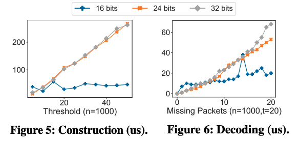
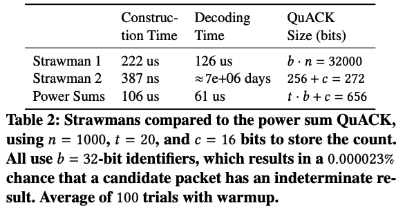

# QuACK

This repository contains code for the HotNets '22 paper,
_[Sidecar: In-Network Performance Enhancements in the Age of
Paranoid Transport Protocols](https://conferences.sigcomm.org/hotnets/2022/papers/hotnets22_yuan.pdf)_.
The _quACK (quick ACK)_ is a concise representation of a
multiset of numbers that can be used to efficiently decode
the randomly-encrypted packet contents a sidecar has received.

## Experiments

Run `make build` to build the binaries.

### Construction Time and Decoding Time (Figures 5 and 6)

<p align="center">
	
</p>

```
make benchmark
cd graphs
```

Then follow the instructions in `graphs/README.md` to plot the data.

### Comparing the QuACK to Strawmans (Table 2)

<p align="center">
	
</p>

```
make table
```
